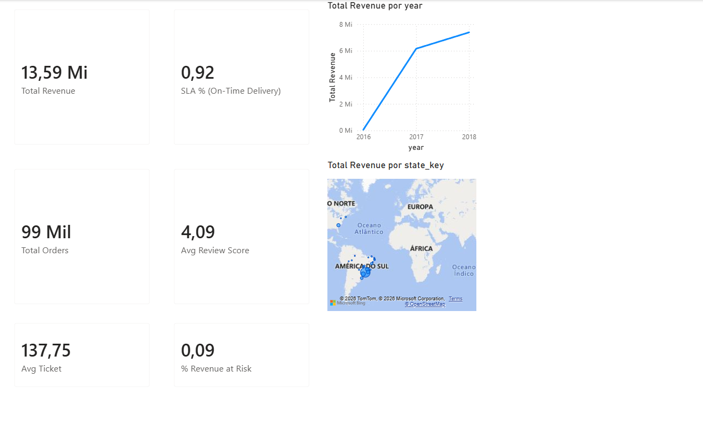
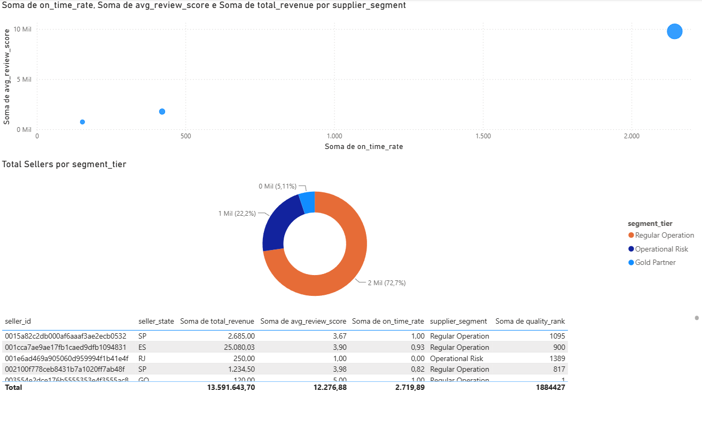
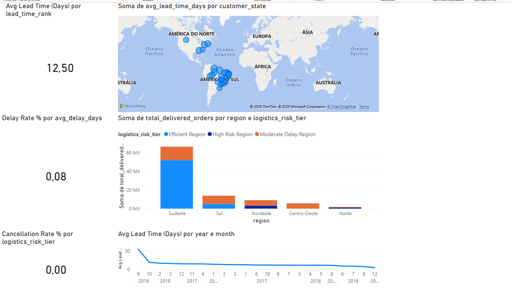
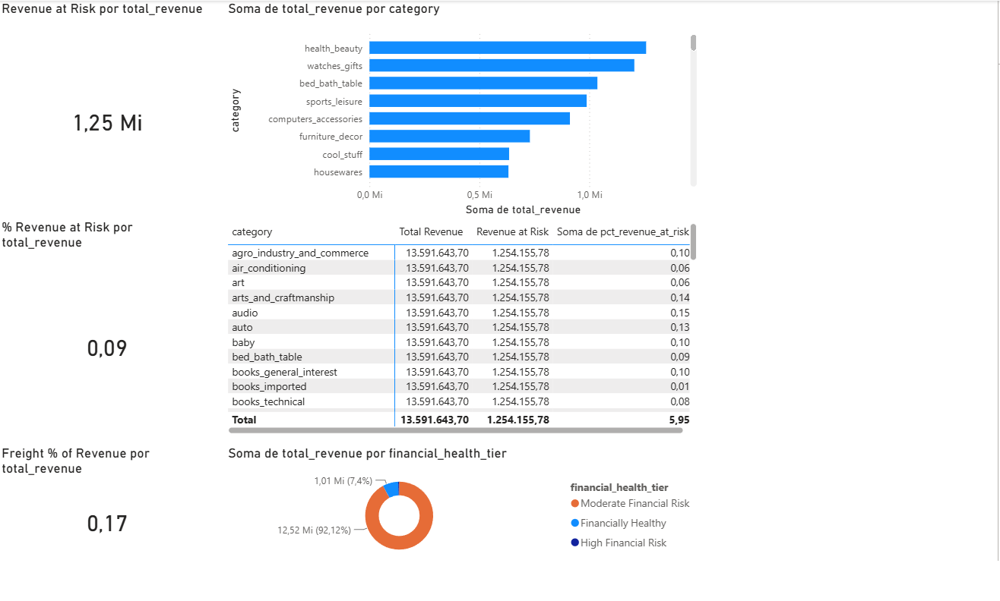

# Olist E-Commerce Analytics

**End-to-end analytics project** simulating a marketplace operations environment (Amazon/Mercado Livre-style), built on the [Brazilian E-Commerce Public Dataset by Olist](https://www.kaggle.com/datasets/olistbr/brazilian-ecommerce) (Kaggle). Covers three business pillars - **Logistics Efficiency**, **Supplier Quality**, and **Financial Health** - end to end: relational modeling in MySQL, advanced SQL (CTEs + window functions), a Star Schema in Power BI, and an executive-level DAX dashboard.

Full technical architecture: [ARCHITECTURE.md](./ARCHITECTURE.md)
Column-level documentation: [docs/data_dictionary.md](./docs/data_dictionary.md)
DAX measures reference: [powerbi/dax_measures.md](./powerbi/dax_measures.md)

---

## Business Questions Answered

| Pillar | Question | Answer |
|---|---|---|
| Financial Health | What's our total revenue and average order value? | R$13.59M in revenue across ~99K orders, averaging R$137.75 per order |
| Financial Health | How much revenue is exposed to cancellations/delays? | R$1.25M (9%) of revenue is tied to cancelled or late-delivered orders |
| Financial Health | How much does freight cost relative to revenue? | Freight represents 17% of total revenue |
| Logistics Efficiency | Are we hitting our delivery SLA? | 92% of orders are delivered on or before the estimated date |
| Logistics Efficiency | What's our average delivery lead time? | 12.5 days average, purchase to customer delivery |
| Logistics Efficiency | Which regions are the biggest logistics bottleneck? | Southeast (Sudeste) handles the highest order volume with the best efficiency; the North (Norte) and parts of the Northeast (Nordeste) show the highest delay rates, consistent with longer shipping distances |
| Supplier Quality | How are sellers distributed by performance? | 72.7% Regular Operation, 22.2% Operational Risk, 5.1% Gold Partner |
| Supplier Quality | What's our average customer satisfaction? | 4.09 / 5.00 average review score |

---

## Dashboard

Four-page executive dashboard built in Power BI Desktop, connected live to MySQL views.

### 1. Executive Overview

Headline KPIs (revenue, orders, SLA, review score, revenue at risk) plus revenue trend and regional distribution. Revenue grew sharply from near-zero in 2016 to ~R$7M in 2018, tracking the platform's real-world growth curve.

### 2. Supplier Quality

Seller segmentation (Gold Partner / Regular Operation / Operational Risk) computed entirely in SQL via DENSE_RANK() and executive-tier CASE logic - Power BI only visualizes, never recalculates the segmentation.

### 3. Logistics Efficiency

Regional lead time and delay-rate analysis, with states ranked nationally and within their own macro-region.

### 4. Financial Health

Revenue-at-risk breakdown by product category, highlighting where cancellations and late deliveries are eroding revenue the most.

---

## Tech Stack

MySQL 8 (Workbench) -> Power BI Desktop -> Executive Summary
Schema + Staging, Star Schema, CTEs + Window Fns, DAX Measures, 3 Executive Views, 4-Page Dashboard

- Database: MySQL 8, 7-table lean relational schema
- Data loading: LOAD DATA LOCAL INFILE, with data-quality checks (nulls, duplicate keys, FK integrity, out-of-range values)
- Analytics layer: 3 executive views (vw_supplier_performance, vw_logistics_regional, vw_financial_health) using multi-CTE chains, DENSE_RANK(), RANK(), PERCENT_RANK(), NTILE(), and AVG() OVER () benchmarks
- BI layer: Star Schema (5 dimensions + 2 facts at different grains) imported into Power BI, with 20 DAX measures across the three business pillars

---

## Repository Structure

olist-ecommerce-analytics/
- README.md - This file
- ARCHITECTURE.md - Full architecture & planning doc
- sql/01_schema/ - DDL for the 7 core tables
- sql/02_staging/ - CSV load + data quality checks
- sql/03_views/ - 3 executive views + Star Schema (dims/facts)
- powerbi/olist_ecommerce_dashboard.pbix
- powerbi/dax_measures.md
- docs/data_dictionary.md
- data/ - Raw Kaggle CSVs
- assets/screenshots/ - Dashboard page exports

---

## How to Reproduce

1. Download the Olist dataset into /data
2. Run sql/01_schema/create_tables.sql in MySQL Workbench
3. Run sql/02_staging/load_data.sql (enable local_infile first - see comments in the script)
4. Run the 3 executive views + dim_tables.sql + fact_tables.sql in sql/03_views/
5. Open Power BI Desktop, connect to MySQL (localhost:3306, database olist_ecommerce), import the views/dims/facts
6. Build relationships as documented in ARCHITECTURE.md (Star Schema section)
7. Open powerbi/olist_ecommerce_dashboard.pbix directly to skip steps 5-6

---

## Known Limitations / Next Steps

Being transparent about current gaps, as part of the project's iterative process:

- State-code map geocoding: the map visuals plot Brazilian state abbreviations (SP, PR, BA...) without a country hint, which occasionally causes Bing's geocoder to place a handful of bubbles outside Brazil. Fix planned: switch to a Shape Map with a Brazil TopoJSON, or add an explicit country = "Brazil" field to the geocoding context.
- Financial Health matrix (Page 4): the category-level matrix currently pulls Total Revenue/Revenue at Risk from the global DAX measures instead of the pre-aggregated columns on vw_financial_health, which has no relationship to fact_orders - this causes the grand total to repeat on every row instead of the per-category breakdown. Fix: swap those two matrix fields for vw_financial_health[total_revenue] / vw_financial_health[revenue_at_risk] directly.
- Future iteration: incorporate order_payments (payment type/installments) into the Financial Health pillar for a payment-method breakdown.

---

## Data Source & License

Data: Brazilian E-Commerce Public Dataset by Olist (Kaggle), licensed CC BY-NC-SA 4.0. This project is for portfolio/educational purposes.